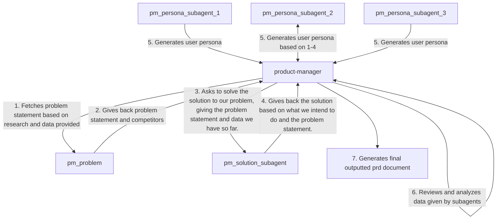

Arguments Provided: `$ARGUMENTS`

## Argument Parsing

- `Idea` (**Required**) - The given idea that the user wants to create a PRD for. If provided with an existing PRD, `Idea` is the PRD provided. 
  - If `Idea` is not provided, prompt the user to provide this information. Stop here. 

From `Idea` parse the following information:

- `NAME`: The product name. 
- `PROBLEM`: What is the problem this product is meant to solves
- `OBJECTIVE`: What this product aims to do
- `AUDIENCE`: Who this product is for

If you are not able to understand any of these fields, prompt the user for more information. 

## Goal

Identify the details needed for `Idea` and create a Product Requirements Diagram (PRD) on it. 

If you are given a PRD already. Analyze it and extract the arguments from it.

Identify missing gaps and fill them in based on the final output format. 

## Document Sections 

### Introduction

This is the eyecatcher. Here, provide a high level overview of what the problem is, who is it for, and what are we trying to fix. 

Just because it is an eyecatcher, does not mean to be extravagant. Be brief and provide no emojis, no jokes or bad comparisons. Focus on the hard facts that we can bring up. 

**Good Example**: "This document is to bring up the product requirements for Fishly, the social media app for fishers. Currently, fishermen have difficulties finding others in their area who have a similar hobby to them. And when trying to find people to join them on long excursions, it can be hard to find help. Fishly aims to solve that by giving an open platform for them to communicate with one another."

**Bad Example**: 
- (too short) "Fishly is the social media app for fishers."
- (too hard at trying to make a comparison) "Fishly is facebook for fishermen"

### Problem 

This section goes into the problem statement. Focus on the following:

  - **Pain Point**: What is the major problem we are looking to solve? What is our product for?
  - **Competitors**: Who out there has similar products to us. What do they provide and where are they lacking. 

Think about what we want to solve and make sure that it is explicit, clear, and easy to understand. 

### Solution

Spawn a @product-manager-mini subagent with the following template. **ALWAYS USE THIS TEMPLATE**

```markdown
# Problem Solution Generation

You are a product manager. We are working on creating a solution for the following problem as part of creating a PRD. 

## Problem Statement

<Problem Statement generated above>

## Variables

- `NAME`: The product name. (Provided by the input arguments) 
- `PROBLEM`: What is the problem this product is meant to solves (Provided by the input arguments)
- `OBJECTIVE`: What this product aims to do (Provided by the input arguments)
- `AUDIENCE`: Who this product is for (Provided by the input arguments)

## Goal

Identify the solution for this problem. Create 1-3 bullet points detailing this. 
```

This section is where we talk about the product we are building. How does it solve these pain points? How does it edge us over the competitors or puts us pound-for-pound against them?

### Personas

Spawn 3 @product-manager-mini subagents with the problem and solution statements above to create personas. Make sure they use the persona skill for this. **ALWAYS USE THIS TEMPLATE**

```markdown
# PRD Persona Generation

You are a product manager. We are working on generating a persona for We are working on creating a solution for the following problem as part of creating a PRD. 

You must load the **Persona** skill to analyze the solution given below.

## Problem Statement

<Problem Statement generated above>

## Variables

- `NAME`: The product name. (Provided by the input arguments) 
- `PROBLEM`: What is the problem this product is meant to solves (Provided by the input arguments)
- `OBJECTIVE`: What this product aims to do (Provided by the input arguments)
- `AUDIENCE`: Who this product is for (Provided by the input arguments)

## Solution

<Solution Statement generated by previous product-manager-mini subagent>
```

In this section, focus on generating user personas to help us get a clear picture of the customers that we will be serving. 

## Final Output

Shape the data from the subagents into the final format provided here. 

```markdown
# (product name) Product Requirements Document

## Introduction 

This document is to serve the product requirements for (product name). ...(1-3 more sentences serving a high level overview of the product)

## Problem

1-3 sentences talking about the problem that we are trying to solve. Feel free to break it down into bullet points if needed.

### Competitors
- **(competitor name)**: 1-3 sentences on the product they provide, where it competes with us, and where it currently lacks. 

## Solution

Talk about the solution we intend to provide. What are we intending to do? What is the way we intend to solve the problem mentioned above. 

### Features
- Bullet point list of features we intend to support

## Personas

### Persona (number): (name) - (position)
 
#### Bio and Demographics
- Bullet point list of general information on the persona 

#### Quotes
- Bullet point list of 1 sentence quotes that serve to give an idea of the persona and what is their pain points. 

#### Pain Points
- Bullet point list of the problems they face. This should give an idea of what our problem solves to fix

#### How We Help
- Bullet point list of how exactly our product intends to help them out
```

## Workflow Diagram


