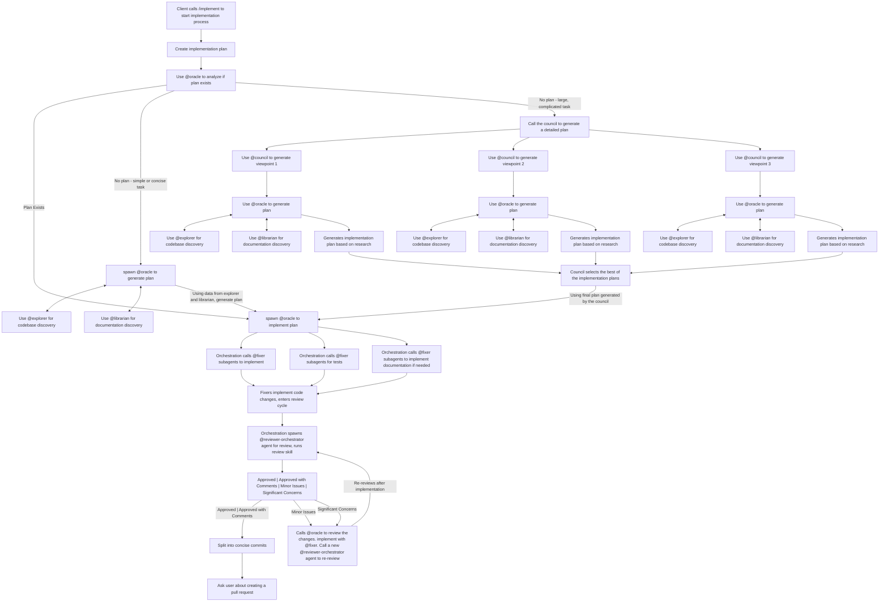

Implement $1 end to end. 

Complete the following checklist: 
- [ ] Analyze the difficulty and clarity of the task we are given, 
  - [ ] If we are given a detailed plan, focus on implementing it and go to the next major bullet point. 
  - [ ] If we are not, generate a plan first to understand implementation details
    - [ ] If the task is simple, spawn an @oracle subagent to generate a plan on what to implement 
    - [ ] If the task is not simple, spawn 3 @council subagents to get viewpoints on what to implement, then use @oracle to generate the plan
  - [ ] Detail any changes that will be needed, what files to add/change, what variables/logic will we need. Use @explorer to dig through the codebase to figure, @librarian to check on documentation. 
- [ ] Based on the plan created above, implement using @fixer subagents. 
  - [ ]  For the implementation, make sure there are tests validating successful implementation. 
  - [ ] Make sure there are documentation changes included, if needed
- [ ] Cycle through revisions. **DO NOT** address comments modifying future tickets, only handle ones modifying the ticket we are working on right now. 
For each cycle, do the following:
  - [ ] Spawn a new @reviewer-orchestrator and do a code review using the  [`review`](~/dotfiles/opencode/.config/opencode/skills/review/SKILL.md) skill.   
  - [ ] Analyze if review status was "Approved" or "Approved with Comments". If so, stop here. 
  - [ ] If status was not "Approved" or "Approved with Comments", review changes needed and implement using @fixer
  - [ ] Spawn a new @reviewer-orchestrator subagent after the previous set of iterations, and repeat.
- [ ] Separate implementation into concise commits 
- [ ] Prompt the user if we would like to make a pull request. 

**Note**: For the review cycles you **must** always use the `review` skill.

## Implementation Diagram

