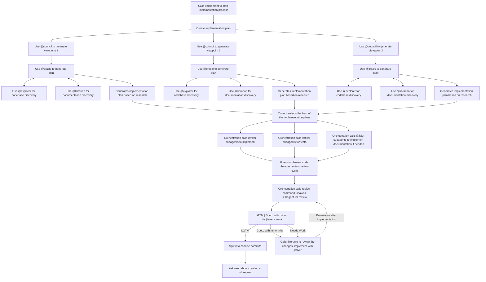

Implement $1 end to end. 

Complete the following checklist: 
- [ ] Create a plan to ensure we are able to successfully implement the details of this ticket. 
  - [ ] Use the @council to spawn 3 viewpoints on the details of the ticket to implement, the findings found by our other subagents. For each council, spawn an @oracle to analyze the details and come up with a successful plan. 
  - [ ] Detail any changes that will be needed, what files to add/change, what variables/logic will we need. Use @explorer to dig through the codebase to figure, @librarian to check on documentation. 
  - [ ] Analyze the findings from the council and use the best option as the plan 
- [ ] Based on the plan created above, implement using @fixer subagents. 
  - [ ]  For the implementation, make sure there are tests validating successful implementation. 
  - [ ] Make sure there are documentation changes included, if needed
- [ ] Cycle through revisions. Run a code review with the same considerations as the [`review`](~/.config/opencode/review.md) command. **DO NOT** address comments modifying future tickets, only handle ones modifying the ticket we are working on right now. 
  - [ ] Spawn a subagent to review the code, if there are any changes that need to be made implement
  - [ ] Spawn a new subagent after the previous set of iterations, and repeat until we get an LGTM.
- [ ] Separate implementation into concise commits 
- [ ] Prompt the user if we would like to make a pull request. 

## Implementation Diagram

